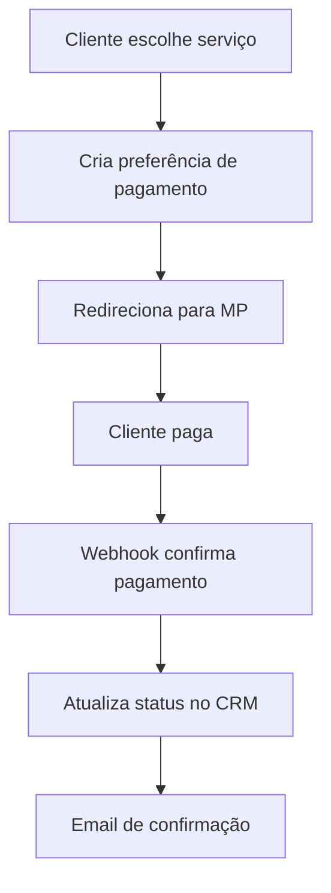

# 🔌 Guia de Integrações - Gomanic Brazil Landing

## 📋 Visão Geral das Integrações

Este documento detalha como configurar e usar todas as integrações disponíveis no projeto.

### Integrações Implementadas

1. **Google Analytics 4** - Análise de tráfego e comportamento
2. **Facebook Pixel** - Rastreamento para campanhas
3. **Fresha CRM** - Gestão de agendamentos e clientes
4. **Mercado Pago** - Gateway de pagamentos
5. **WhatsApp Business** - Atendimento e conversão
6. **Email SMTP** - Notificações e confirmações

---

## 📊 Google Analytics 4

### Configuração

1. **Criar Propriedade GA4**
   - Acesse [Google Analytics](https://analytics.google.com)
   - Crie nova propriedade para o site
   - Configure timezone para "America/Sao_Paulo"
   - Obtenha o ID (formato: G-XXXXXXXXXX)

2. **Configurar no Projeto**
   ```bash
   # Adicionar ao .env.local
   GOOGLE_ANALYTICS_ID=G-XXXXXXXXXX
   ```

3. **Verificar Implementação**
   - Acesse o site em modo incógnito
   - Vá ao GA4 > Relatórios > Tempo real
   - Confirme que o usuário aparece

### Eventos Rastreados

```javascript
// Eventos automáticos implementados:
- page_view               // Visualização de página
- agendamento_iniciado    // Formulário de agendamento
- whatsapp_click         // Clique no WhatsApp
- instagram_click        // Clique no Instagram
- portfolio_view         // Visualização de imagem do portfólio
```

### Goals e Conversões

Configure os seguintes objetivos no GA4:

1. **Agendamento Concluído**
   - Tipo: Evento personalizado
   - Nome: `agendamento_iniciado`
   - Valor: True

2. **WhatsApp Contact**
   - Tipo: Evento personalizado
   - Nome: `whatsapp_click`

3. **Instagram Follow**
   - Tipo: Evento personalizado
   - Nome: `instagram_click`

---

## 💳 Mercado Pago

### Configuração da Conta

1. **Criar Conta Mercado Pago**
   - Acesse [Mercado Pago Developers](https://developers.mercadopago.com.br)
   - Crie aplicação
   - Obtenha credenciais de produção

2. **Configurar Webhook**
   ```bash
   # URL do Webhook no painel MP:
   https://seu-dominio.com.br/api/mercadopago/webhook
   
   # Eventos a escutar:
   - payment (pagamentos)
   - plan (assinaturas)
   - subscription (renovações)
   ```

3. **Adicionar Credenciais**
   ```bash
   # .env.local
   MERCADO_PAGO_ACCESS_TOKEN=your_access_token
   MERCADO_PAGO_PUBLIC_KEY=your_public_key
   ```

### Fluxo de Pagamento



### Pacotes de Serviços

```javascript
// Configurados em src/utils/mercadopago.js
{
  manicure_basic: {
    name: "Manicure + Nivelamento + Esmaltação em Gel",
    price: 80.00,
    originalPrice: 160.00
  },
  manicure_along: {
    name: "Alongamento + Manicure + Esmaltação em Gel", 
    price: 119.00,
    originalPrice: 200.00
  },
  combo_complete: {
    name: "Combo Completo",
    price: 160.00,
    originalPrice: 320.00
  }
}
```

---

## 💼 Fresha CRM

### Configuração Inicial

1. **Obter Credenciais**
   - Acesse [Fresha Developer](https://developers.fresha.com)
   - Crie aplicação
   - Obtenha API Key e configure Webhook

2. **Configurar no Projeto**
   ```bash
   # .env.local
   FRESHA_API_KEY=your_fresha_api_key
   FRESHA_WEBHOOK_URL=https://api.fresha.com/webhooks/your-endpoint
   ```

### Campos Enviados

```javascript
{
  customer: {
    firstName: "Nome",
    lastName: "Sobrenome", 
    phone: "48999999999",
    email: "cliente@email.com"
  },
  service: "Manicure + Esmaltação",
  preferredDate: "2025-01-15",
  preferredTime: "14:00",
  notes: "Observações do cliente",
  source: "website_landing"
}
```

---

## 📱 WhatsApp Business

### Configuração Básica

O projeto já inclui links diretos para WhatsApp:
- **Número**: +55 48 99673-7351
- **Formato**: `https://wa.me/5548996737351`

### Mensagens Automáticas

```javascript
// Configuradas por seção:
agendamento: "Olá! Gostaria de agendar um horário para manicure."
portfolio: "Vi o portfólio e gostaria de mais informações."
promocoes: "Tenho interesse nas promoções do mês."
```

### WhatsApp Business API (Avançado)

Para automação completa:

1. **Configurar Conta Business**
   - Verificar número no WhatsApp Business
   - Solicitar acesso à API no Facebook Developers

2. **Adicionar Credenciais**
   ```bash
   # .env.local
   WHATSAPP_API_KEY=your_api_key
   WHATSAPP_PHONE_ID=your_phone_id
   ```

3. **Automações Possíveis**
   - Confirmação automática de agendamento
   - Lembretes de consulta
   - Follow-up pós-atendimento

---

## 📧 Email SMTP

### Configuração Gmail

1. **Preparar Conta Gmail**
   - Ativar verificação em 2 etapas
   - Gerar senha de app específica

2. **Configurar no Projeto**
   ```bash
   # .env.local
   SMTP_HOST=smtp.gmail.com
   SMTP_USER=seu-email@gmail.com
   SMTP_PASS=sua-senha-app
   ```

### Templates de Email

```javascript
// Confirmação de agendamento
subject: "Agendamento Confirmado - Unhas 5 Estrelas"
template: `
  Olá {nome},
  
  Seu agendamento foi confirmado:
  - Serviço: {servico}
  - Data: {data}
  - Horário: {horario}
  
  Local: Sala 1, Rod. Armando Calil Bulos, 5795
  
  Atenciosamente,
  Equipe Unhas 5 Estrelas
`

// Lembrete (1 dia antes)
subject: "Lembrete: Seu agendamento é amanhã"
template: `
  Olá {nome},
  
  Lembrando que você tem agendamento amanhã:
  - {data} às {horario}
  
  Caso precise remarcar: (48) 99673-7351
`
```

---

## 🔍 SEO e Schema.org

### Dados Estruturados

O projeto inclui Schema.org para melhor indexação:

```javascript
// LocalBusiness Schema
{
  "@type": "BeautySalon",
  "name": "Unhas 5 Estrelas",
  "address": {
    "streetAddress": "Rod. Armando Calil Bulos, 5795",
    "addressLocality": "Florianópolis",
    "addressRegion": "SC",
    "postalCode": "88058-001"
  },
  "telephone": "+55 48 99673-7351",
  "openingHours": ["Mo-Fr 09:00-18:00", "Sa 09:00-16:00"]
}
```

### Meta Tags Configuradas

- **Title**: Otimizado para "manicure Florianópolis"
- **Description**: Call-to-action claro
- **Open Graph**: Para compartilhamento em redes sociais
- **Canonical**: URLs limpas

---

## 📊 Monitoramento e Analytics

### Dashboards Recomendados

1. **Google Analytics 4**
   - Tráfego por fonte
   - Taxa de conversão de agendamentos
   - Comportamento do usuário

2. **Facebook Analytics**
   - Performance de campanhas
   - Dados demográficos
   - ROI de anúncios

3. **Fresha Reports**
   - Leads convertidos
   - Receita por canal
   - Satisfação do cliente

### KPIs Importantes

```javascript
// Métricas de conversão
- Taxa de agendamento: formulários enviados / visitantes
- Custo por lead: gasto em ads / leads gerados
- Lifetime value: receita média por cliente
- Taxa de retenção: clientes que retornaram

// Métricas de performance
- Tempo de carregamento da página
- Taxa de rejeição
- Páginas por sessão
- Tempo médio na página
```

---

## 🧪 Testes de Integração

### Checklist de Testes

```bash
# 1. Google Analytics
✅ Pageview sendo registrado
✅ Eventos de interação funcionando
✅ Goals configurados corretamente

# 2. Facebook Pixel
✅ Pixel Helper mostra eventos
✅ Eventos customizados disparando
✅ Públicos sendo criados

# 3. Fresha CRM
✅ API retorna sucesso (200)
✅ Leads aparecendo no painel
✅ Dados corretos sendo enviados

# 4. Mercado Pago
✅ Criação de preferência funciona
✅ Redirecionamento para checkout
✅ Webhook recebe confirmações

# 5. WhatsApp
✅ Links abrem no WhatsApp
✅ Mensagem correta pré-preenchida
✅ Número correto configurado

# 6. Email SMTP
✅ Emails sendo enviados
✅ Templates corretos
✅ Não indo para spam
```

### Comandos de Teste

```bash
# Testar API de contato
curl -X POST https://seu-dominio.com.br/api/contact \
  -H "Content-Type: application/json" \
  -d '{
    "name": "Teste",
    "phone": "48999999999",
    "email": "teste@email.com",
    "service": "Manicure básica",
    "date": "2025-01-20",
    "time": "14:00"
  }'

# Verificar Analytics (browser console)
gtag('event', 'test_event', {
  'event_category': 'test',
  'event_label': 'manual_test'
});

# Testar Facebook Pixel (browser console)
fbq('track', 'Lead', {
  'content_name': 'test_lead'
});
```

---

## 🔧 Troubleshooting

### Problemas Comuns

**Analytics não rastreia:**
```bash
# Verificar configuração
console.log(window.gtag); // Deve existir
console.log(window.dataLayer); // Deve ter dados
```

**Fresha não recebe dados:**
```bash
# Verificar logs da aplicação
pm2 logs gomanic-brazil-landing | grep "Fresha"

# Testar API manualmente
curl -X POST $FRESHA_WEBHOOK_URL \
  -H "Authorization: Bearer $FRESHA_API_KEY" \
  -H "Content-Type: application/json" \
  -d '{"test": "data"}'
```

**Emails não chegam:**
```bash
# Verificar configurações SMTP
telnet smtp.gmail.com 587
# Se conectar, as configurações estão corretas
```

### Logs Úteis

```bash
# Aplicação
pm2 logs --lines 100

# Nginx
sudo tail -f /var/log/nginx/gomanic-brazil.access.log

# Sistema
sudo journalctl -u nginx -f
```

---

## 📈 Otimizações Futuras

### Integrações Adicionais

1. **Zapier** - Conectar diferentes serviços
2. **Google My Business** - Reviews automáticos
3. **Calendly** - Agendamento avançado
4. **Intercom** - Chat em tempo real
5. **Mailchimp** - Email marketing

### Automações Avançadas

1. **Remarketing por email** - Para quem abandonou o formulário
2. **SMS de confirmação** - Via Twilio ou similar
3. **Review automático** - Solicitar avaliação pós-serviço
4. **Programa de fidelidade** - Pontos por indicação

---

**📅 Última atualização:** Janeiro 2025
**🔗 Integrações ativas:** 6
**📊 Eventos rastreados:** 5+
**💰 Gateway de pagamento:** Mercado Pago
